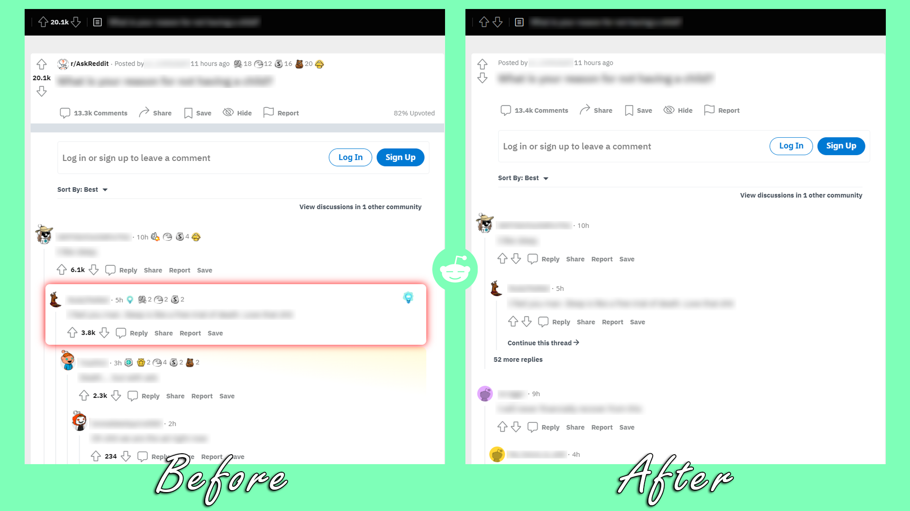

</img>

<h1 align="center">Unbiased for Reddit</h1>

Unbiased for Reddit is a browser extension that hides vote counts and awards on www.reddit.com and old.reddit.com, helping you avoid bias before viewing content.

</img>

## Get the Extension

**Firefox:** https://addons.mozilla.org/en-US/firefox/addon/unbiased-for-reddit/